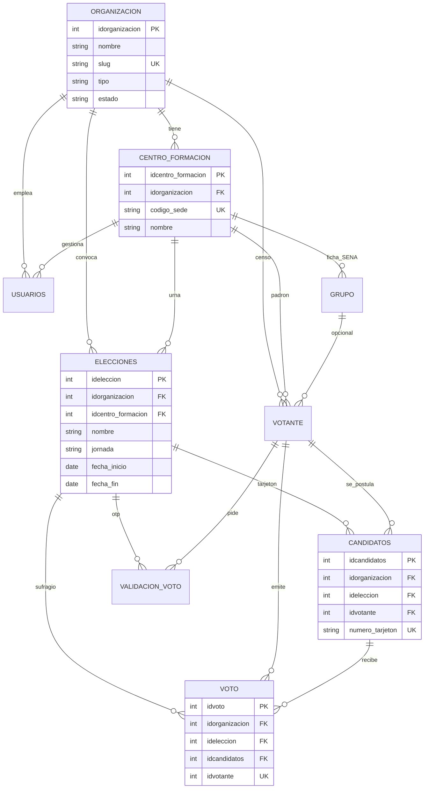

# Modelo de datos multi-tenant — centros, votaciones y candidatos

Esto es **análisis de datos**, no código de la urna. Modelar aquí significa: tablas, dueño de cada fila, llaves foráneas, unicidades y reglas de aislamiento. No se implementa JWT, no se reescribe el API y no se inventan reglas que el PO no haya cerrado.

Hoy SIGEVA ya aísla por **centro de formación**. Eso es multi-sede. **No es multi-tenant.** El tenant (la organización dueña de los datos) no existe como tabla. Un colegio y el SENA no pueden compartir esta base sin mezclar padrones.

Patrón elegido: **una base, un esquema, columna `idorganizacion` en todo lo electoral.** El SENA queda como el primer tenant, con muchos centros. Un colegio es otro tenant, con una o varias sedes.

Multi-tenant **no** significa una tabla distinta por tipo de institución. Significa las **mismas** tablas, con dueño distinto. Un colegio no tiene “aprendices”; tiene un **censo de votantes**. El SENA llama aprendiz a esa misma fila.

| Tenant | Cómo le dicen al censo | Tabla |
| --- | --- | --- |
| SENA | Aprendiz | `votante` (hoy se llama `aprendiz` en el código) |
| Colegio / universidad | Estudiante | la misma `votante` |
| Empresa | Colaborador | la misma `votante` |

No se crean `estudiante` ni `empleado`. Ficha, programa y jornada son **campos opcionales** del SENA (`NULL` en otro cliente). Lo obligatorio en todos: organización, sede, documento, correo, estado. El candidato sale de ese censo, no de un nombre suelto.

La misma lógica aplica a `centro_formacion`: en plataforma es **sede**. El SENA la sigue llamando centro.

### Ver el diagrama

| Dónde | Archivo | Cómo |
| --- | --- | --- |
| Lucidchart | `erd-lucidchart.sql` | File → Import → SQL → PostgreSQL → pegar el archivo |
| dbdiagram.io | `modelo-sigeva.dbml` | Import → DBML → pegar. Sale el ERD en 10 segundos |
| Cursor | canvas *modelo multi-tenant* | Pestaña «Mañana (to-be)» |



---

## 1. Qué pidieron modelar y qué significa

| Pedido | Qué se modela | Qué no se modela todavía |
| --- | --- | --- |
| Centros de formación | Sede de un tenant (circunscripción territorial) | CRUD de regionales como valor de urna |
| Votaciones | Elección con ventana, jornada y dueño | Segunda vuelta, voto en blanco |
| Candidatos | Persona del censo + tarjetón único en esa elección | Campaña, foros, ranking público |

El votante (aprendiz), el gestor (funcionario) y el voto ya existen. Hay que **colgarlos de una organización** para que dos instituciones no se vean.

---

## 2. As-is (hoy en PostgreSQL / Lucid)

```
departamento → municipio → regional → centro_formacion   ← tenant implícito
                                      ├── usuarios (funcionario)
                                      ├── aprendiz (censo)
                                      │     ├── grupo / jornada
                                      │     └── programa_formacion
                                      └── elecciones
                                            ├── candidatos (aprendiz + foto + propuesta + tarjetón)
                                            ├── validacionvoto (OTP; VOTED_ / USED_ van en el código)
                                            └── votoxcandidato
```

Hechos del código actual (no se niegan):

- `elecciones.idcentro_formacion` acota la contienda a una sede.
- El candidato es un aprendiz del censo; el tarjetón es único **por elección**.
- El OTP comprueba que aprendiz y elección sean del mismo centro.
- El voto único se defiende en middleware, **no** con `UNIQUE (idaprendiz, ideleccion)`.
- No hay tabla `organizacion`. El correo del usuario es único **en todo el sistema**.

---

## 3. To-be — dueño de los datos

```
organizacion                         ← TENANT (SENA, un colegio, una universidad)
 └── centro_formacion                ← sede / circunscripción
       ├── usuarios                  ← gestor de esa sede (o admin del tenant sin sede fija)
       ├── grupo                     ← ficha; jornada Mañana/Tarde/Noche (SENA)
       ├── aprendiz                  ← censo / padrón
       └── elecciones                ← votación de esa sede
             ├── candidatos
             ├── validacion_voto     ← OTP (probar buzón ≠ votar)
             └── voto                ← un aprendiz, una elección, un sufragio
```

Geografía Colombia (`departamento`, `municipio`) puede seguir **compartida**. `regional` es catálogo SENA: vive dentro del tenant SENA, no en el núcleo de la urna.

| Concepto SENA (as-is) | Plataforma (to-be) |
| --- | --- |
| El mundo es el SENA | `organizacion` (tenant) |
| Centro de formación | Sede del tenant |
| Aprendiz | Votante del censo |
| Funcionario | Gestor de una sede |
| Administrador único | Operador de plataforma + admin del tenant |
| Jornada Mañana/Tarde/Noche | Dimensión de circunscripción (obligatoria en SENA; opcional en otro cliente) |

---

## 4. Entidad `organizacion` (tenant)

Dueña de censo, sedes, elecciones, candidatos y votos. Sin esta fila no hay multi-tenant.

| Campo | Tipo | Regla |
| --- | --- | --- |
| `idorganizacion` | PK | |
| `nombre` | texto, obligatorio | |
| `slug` | texto, **único global** | Identificador estable (`sena`, `colegio-x`) |
| `tipo` | SENA / colegio / universidad / empresa / otro | El tipo SENA habilita regional + jornada |
| `nit` | texto, opcional | |
| `estado` | Activo / Suspendido | Suspendido: nadie de ese tenant entra a urna ni a gestión |

Primer registro: organización SENA. Los centros de `subida_centros_formacion.sql` quedan colgados de ese id.

---

## 5. Centros de formación (sedes)

Dejan de ser “el mundo”. Pasan a ser **sedes de un tenant**.

| Campo | Regla to-be |
| --- | --- |
| `idcentro_formacion` | PK (se pueden conservar los códigos SENA 9101, 9201…) |
| `idorganizacion` | **Obligatorio.** Dueño. |
| `idregional` | Solo tenant SENA; `NULL` en un colegio |
| `idmunicipios` | Ubicación; catálogo compartido |
| `codigo_sede` | Código institucional; **único por tenant** |
| `centro_formacioncol` | Nombre |
| dirección, teléfono, correo, subdirector, correosubdirector | Igual que hoy |
| `estado` | Activo / Inactivo |

**Unicidad:** `(idorganizacion, codigo_sede)`.

**Aislamiento:**

- El funcionario solo ve/edita el centro de su sesión.
- El admin del tenant lista los centros de **su** `idorganizacion`.
- El operador de plataforma da de alta organizaciones; no opera la urna de una sede.

El censo (`aprendiz`) y el gestor (`usuarios`) ya apuntan al centro. Les falta `idorganizacion` (desnormalizado) para filtrar sin joins frágiles.

---

## 6. Votaciones (`elecciones`)

Una votación es una contienda **de una sede, de un tenant**, con ventana oficial.

| Campo | Regla |
| --- | --- |
| `ideleccion` | PK |
| `idorganizacion` | Obligatorio (copia del centro; no se toma del body) |
| `idcentro_formacion` | Obligatorio; el centro debe ser de esa organización |
| `nombre` | Obligatorio |
| `jornada` | Mañana / Tarde / Noche en SENA; `NULL` si el tenant no usa jornada |
| `fecha_inicio`, `fecha_fin` | Obligatorias; inicio ≤ fin |
| `hora_inicio`, `hora_fin` | Obligatorias; en el mismo día, hora inicio ≤ hora fin |

**No se persiste “activa”.** Activa = ahora está dentro de fecha **y** hora. Fuera de esa ventana la urna no existe (invariante 4).

**Aislamiento:**

- Crear/editar/listar: funcionario solo su centro; nunca otra organización.
- El aprendiz lista solo elecciones de **su** centro, **su** jornada y ventana vigente.
- El listado “todas las activas del país” queda prohibido.

Pregunta abierta (no se cierra aquí): si ya hay votos, ¿se puede editar la ventana? Eso es RN-P, no se inventa.

---

## 7. Candidatos (tarjetón)

Un candidato no es un nombre suelto. Es **una persona del censo de esa organización**, inscrita en **una** elección, con número de tarjetón único **en esa** elección.

| Campo | Regla |
| --- | --- |
| `idcandidatos` | PK |
| `idorganizacion` | Obligatorio (el de la elección) |
| `ideleccion` | Obligatorio |
| `idaprendiz` | Obligatorio; el aprendiz debe ser del mismo centro (y tenant) que la elección |
| `nombres` | Snapshot o lectura del censo; hoy se guarda en la fila |
| `propuesta` | Texto |
| `foto` | URL (Cloudinary) |
| `numero_tarjeton` | Obligatorio |

**Unicidades (las que el producto ya exige y el modelo debe defender):**

- `(ideleccion, numero_tarjeton)` — no dos “03” en la misma urna.
- `(ideleccion, idaprendiz)` — una persona no se inscribe dos veces en la misma contienda.

**Aislamiento:** no se listan candidatos de otra sede ni de otro tenant. El orden al votante se baraja (`RANDOM()`); eso es presentación, no dato.

---

## 8. Voto y OTP (cierran la votación)

Sin esto el modelo de “votaciones” queda a medias.

### `voto` (hoy `votoxcandidato`)

| Campo | Regla |
| --- | --- |
| `idvotoxcandidato` | PK |
| `idorganizacion` | Obligatorio |
| `ideleccion` | Obligatorio (hoy no está; hay que desnormalizarlo) |
| `idcandidatos` | Obligatorio; el candidato debe ser de esa elección |
| `idaprendiz` | Obligatorio; mismo censo / mismo centro |
| `contador` | En el as-is existe; el modelo to-be trata el voto como **una fila = un sufragio**, no como acumulador |

**Unicidad de urna:** `UNIQUE (idaprendiz, ideleccion)`. El middleware deja de ser la única defensa.

### `validacion_voto` (OTP)

Hoy el estado va **mezclado en el código** (`USED_`, `VOTED_`). El modelo limpio separa:

| Campo | Regla |
| --- | --- |
| `id` | PK |
| `idorganizacion` | Obligatorio |
| `idaprendiz`, `ideleccion` | Mismo tenant y mismo centro |
| `codigo` | 6 caracteres; **solo el OTP**, sin prefijos |
| `estado` | `generado` / `usado` / `votado` |
| `expira_en` | created_at + TTL (hoy 5 minutos) |

Validar OTP **no** inserta voto. El voto es un segundo acto (invariante 2).

---

## 9. Regla de oro del aislamiento

Toda tabla electoral lleva `idorganizacion`. Ese valor **nunca** lo elige el cliente en el body: sale de la sesión (funcionario/admin) o del censo (aprendiz).

Encadenamiento que hay que cumplir al escribir:

1. `centro.idorganizacion = organizacion`
2. `aprendiz.idorganizacion = aprendiz.centro.idorganizacion`
3. `eleccion.idorganizacion = eleccion.centro.idorganizacion`
4. `candidato.idorganizacion = candidato.eleccion.idorganizacion`
5. `candidato.aprendiz` es del mismo centro que la elección
6. `voto.idorganizacion = voto.eleccion.idorganizacion`
7. `voto.aprendiz` no tiene ya fila en esa elección

Si alguna igualdad se rompe, no se persiste. Eso es el tenant.

Correos y documentos dejan de ser únicos en el planeta: pasan a `UNIQUE (idorganizacion, email)` y `UNIQUE (idorganizacion, tipo_documento, numero_documento)`.

---

## 10. Qué no entra en este modelo

- Tabla por cliente (schema-per-tenant). No hace falta para el primer salto.
- Que el administrador “se haga funcionario” de una sede como entidad.
- Voto en blanco / nulo / segunda vuelta (no hay HU).
- JWT como tabla (es sesión, no dominio electoral).
- Cerrar RN-P01…P10 (editar elección con votos, etc.).

---

## 11. Orden de implementación (cuando salga de análisis)

1. Tabla `organizacion` + seed SENA.
2. `idorganizacion` en `centro_formacion` y backfill.
3. Misma columna en `usuarios`, `aprendiz`, `grupo`.
4. Misma columna en `elecciones`, `candidatos`.
5. `ideleccion` + `idorganizacion` + unique de voto en `votoxcandidato`.
6. Separar estado del OTP en `validacionvoto`.
7. Filtro obligatorio por tenant en repositorios / middleware.

Hasta el paso 7 el modelo está dibujado; el producto sigue siendo multi-sede SENA.
